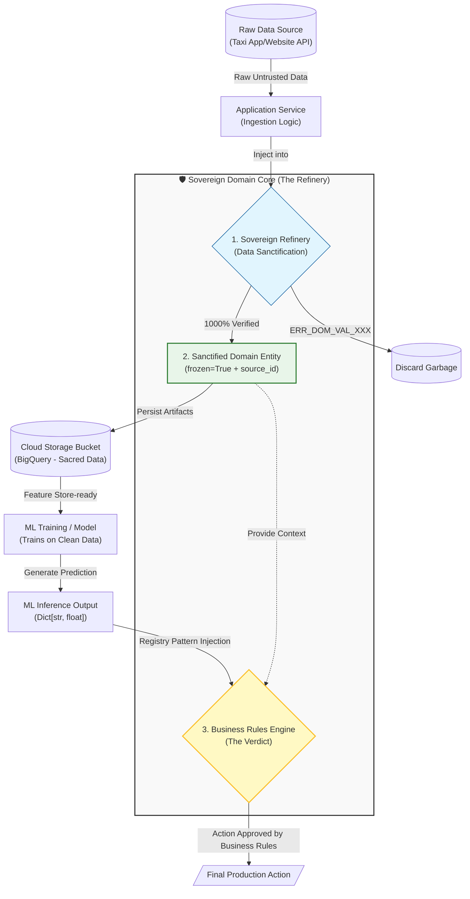

# 🚕 STIE: Sovereign Taxi Inference Engine

### *The Sovereign Hexagonal Blueprint for Industrial ML*

> **"Architecture is the art of planning for the unknown. We don't just build code; we build sovereign digital assets designed to outlast the tools."**

______________________________________________________________________

### 👤 Principal Architect & Strategic Inquiry

**Ali Ahmed Nour** *Principal Architect for Sovereign Hexagonal & DDD Systems*

[](https://www.linkedin.com/in/ali-ahmed-nour/)
[](https://wa.me/201007871314)
[](tel:+201288061914)
[](tel:+201007871314)

______________________________________________________________________

## 🗺️ System Blueprint (The Sovereign Data Loop)



______________________________________________________________________

### Part II: The Sovereign Thesis & Strategic Values

````markdown
### 🎯 The Sovereign Thesis
STIE is a Future-Proof engineered **Unified Inference Hub** designed for NYC Taxi operations. This platform represents an evolution from being "Agnostic" to being **Sovereign**. 

In this architecture, the **Business Logic is the Sovereign Power**. We treat the core of the project as a **Sovereign Sanctuary** (Domain Core) with zero external dependencies. All external tools (Google Cloud, BigQuery, ML Engines) are merely **"Interchangeable Gears" (تروس)** that serve the logic; the logic never serves them.

## 💎 Strategic Core Values

- **The Refinery Protocol (Data Sanctification):** We enforce a zero-tolerance policy for data noise. Only "Sanctified" records reach the BigQuery sink, ensuring ML models train on ground truth.
- **The Supreme Decision Maker (Verdict Loop):** The Core holds the final verdict. If an ML model predicts a value that violates sovereign business invariants (e.g., Peak-Hour Surge limits), the Core overrides it. *The Model proposes, the Core disposes.*
- **Zero Vendor Lock-in:** Cloud-agnostic by design. We maintain full ownership of the Intellectual Property. Migration between cloud providers is a matter of swapping adapters, not rewriting logic.
- **Multi-Model Scalability:** Designed to evolve from a single prediction engine to a **Unified Hub** (Duration, Tip, Cancellation) without altering core infrastructure.
- **Economic Optimization:** Powered by **Polars (Lazy API)**, the system minimizes computational footprint, leading to lower infrastructure costs and higher processing speeds.
- **Institutional Transparency:** Full adherence to the **10-File Documentation Standard** ensures a permanent, audit-ready asset for any global team.
- **Strict Provenance (Traceability):** Every entity carries its `source_id`, ensuring full auditability from the raw ingestion point to the final inference.

---
## Part III: Engineering & Quality DNA

#### 🛡️ Sovereign Hexagonal Implementation
- **Domain Core (The Sanctuary):** Zero external library imports; contains pure business logic and immutable entities (Python 3.12+).
- **Application Layer (The Orchestrator):** Defines **Strict Ports** (Interfaces) for data ingestion and inference.
- **Infrastructure Layer (The Laborers):** Implements swappable adapters for Polars, ML engines, and Cloud APIs.

#### ⚡ Performance & Integrity Guardrails
- **Memory Efficiency (SOTA):** All entities utilize `__slots__` and `frozen=True` for extreme RAM optimization.
- **The Lazy Protocol:** Integration of **Polars Lazy API** with Projection and Predicate Pushdown to optimize query plans.
- **Sovereign Registry Pattern:** Flexible storage for multiple model outputs using a `Dict[str, float]` within the core entity.

#### 🧪 Quality & MLOps Governance
- **Enterprise-Grade Code Quality:** Managed via **SonarQube** for continuous monitoring of Technical Debt and Security Hotspots.
- **Sovereign Error Taxonomy:** Every failure returns a deterministic code (e.g., `ERR_DOM_VAL_001`) for industrial-grade monitoring.
- **Static Guardrails:** Strict **Pyright** static analysis to ensure 100% type-safety across the Sanctuary.
- **Test & Logic Integrity:** Enforced via **pytest**, **Hypothesis** (PBT), and **Factory-Boy** mocking.
- **Deterministic Environments:** Powered by **uv project** (Mandatory) for reproducible and sovereign dependency management.
- **Model Provenance:** **MLflow** integration for full experiment lineage and automated registry promotion.

---
## Part IV: Documentation & Execution Roadmap

## 📂 Documentation Hub
For deep architectural insights, refer to our **Sovereign Documentation Hub**:
- **[01_Architecture_Strategy](docs/01_Architecture_Strategy/hexagonal_layers.md):** Isolation mandates.
- **[02_Domain_Core](docs/02_Domain_Core/unified_entity.md):** Entity blueprints.
- **[03_Infrastructure_Adapters](docs/03_Infrastructure_Adapters/data_ingestion.md):** Data engines.
- **[04_Quality_Assurance](docs/04_Quality_Assurance/error_codes.md):** Error taxonomy.

## 🚧 Execution Roadmap

| Phase | Milestone | Strategic Objective | Target Context | Status |
| :--- | :--- | :--- | :--- | :--- |
| **1** | **Foundational DNA** | Environment Hardening & Security Guardrails. | `uv`, `pre-commit` | ✅ Done |
| **2** | **Structural Blueprint** | Defining Hexagonal Ports for Ingestion & Inference. | `core/application/` | ✅ Done |
| **3** | **Sovereign Brain** | **Refinery Logic: Entities, Sanctification & Business Overrides.** | `core/domain/` | 🚀 **Ongoing** |
| **4** | **Orchestration** | Use-Case implementation & Feedback Loop flows. | `core/application/` | ⏳ Pending |
| **5** | **Infrastructure** | High-speed Laborers for Polars & ML Engines. | `infrastructure/` | ⏳ Pending |
| **6** | **Industrial Ops** | Enterprise QA (SonarQube) & Main Integration. | `main.py` | ⏳ Pending |

---
### 🚀 Quick Start
```bash
# Sync sovereign environment
uv sync 
source .venv/bin/activate
```
# Execute Quality Suite
pytest


______________________________________________________________________

> *"Architected for the Future of NYC Mobility. Designed to Outlast the Tools."*
````
