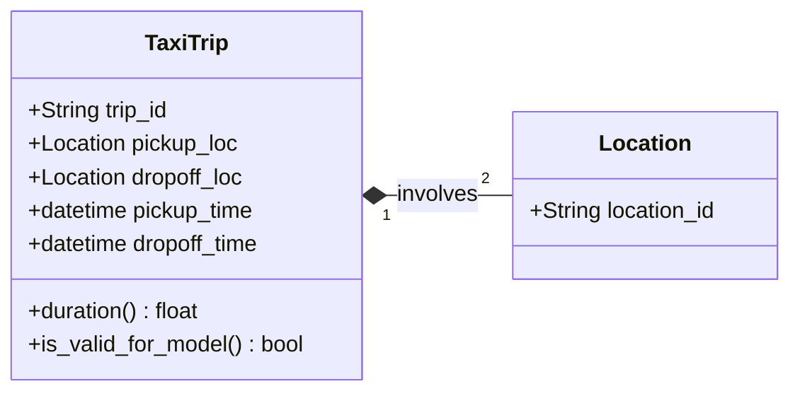

# 🚕 NYC Taxi Duration Prediction: End-to-End MLOps Pipeline

[](https://www.python.org/)
[](https://en.wikipedia.org/wiki/MLOps)
[](https://github.com/astral-sh/uv)
[](<https://en.wikipedia.org/wiki/Hexagonal_architecture_(software)>)

A production-ready MLOps project designed to predict taxi trip durations in NYC. This project transitions from research notebooks to a robust, cloud-agnostic pipeline, emphasizing **Software Architecture** and engineering excellence.

## 🎯 Business Problem

Predicting trip duration is critical for urban mobility services. Accurate estimates improve user experience, optimize driver dispatching, and enhance fare estimation. This project builds a high-performance model to tackle this challenge using NYC Taxi & Limousine Commission (TLC) data.

## 🏗️ Architecture & Engineering Principles

The project is built with a **"Production-First"** mindset, adhering to modern software design patterns:

- **Hexagonal Architecture (Ports & Adapters):** Decouples core ML logic from external infrastructure.
- **Single Source of Truth (SSoT):** A centralized configuration layer manages all paths, features, and model parameters.
- **Memory Optimization:** Vectorized downcasting (e.g., `float32`) and efficient data handling to process millions of records.
- **Type Safety & Quality:** Fully typed using Python's `dataclasses` and verified with **Pyright** and **Ruff**.

______________________________________________________________________

## 🏛️ Detailed Technical Architecture

> **🚧 Project Status:** Currently refactoring the codebase to strictly adhere to **Hexagonal Architecture** principles for better scalability and testability.

### 🧩 Domain Model (The Core)

At the heart of our "Hexagon" lies the Domain Model. These are pure Python entities that encapsulate the business rules of a taxi trip, independent of any data-frame library or storage engine. 

> **Note:** For this initial phase, the model is kept minimal to focus on the end-to-end pipeline infrastructure.



### 🌉 Layers Responsibility

- **Domain Layer (`src/core/domain`):** Contains entities like `TaxiTrip`. It defines *what* a trip is and its validation rules (e.g., duration must be 1-60 mins).
- **Adapter Layer (`src/adapters`):** Handles data I/O (e.g., reading Parquet files via Pandas). It maps raw data into Domain Entities and handles memory precision (`float32`).
- **Application Layer (`src/core/services`):** Orchestrates the flow, calling adapters to fetch data and passing it to the core for training or inference.
______________________________________________________________________

## 📂 Project Structure

```text
.
├── src/
│   ├── core/
│   │   ├── domain/        # Pure ML Logic & Entities (The Hexagon Center)
│   │   └── services/      # Business Use Cases (Training/Inference Orchestration)
│   ├── ports/             # Abstract Interfaces (StoragePort, TrackerPort)
│   ├── adapters/          # Implementation details (GCS, Local, Parquet, MLflow)
│   └── config.py          # Centralized SSoT Configuration
├── notebooks/             # Exploratory Data Analysis & Research
├── data/                  # Local data storage (Git ignored)
├── models/                # Local model artifacts (Git ignored)
├── justfile               # Workflow automation commands
└── pyproject.toml         # Dependency management (uv)
```

## 🛠️ Tech Stack

- **Environment:** `uv` (Fast Python package manager).
- **Automation:** `Just` (Command runner).
- **Core ML:** `Scikit-learn`, `XGBoost`, `Pandas`.
- **Experiment Tracking:** `MLflow`.
- **Static Analysis:** `Ruff`, `Pyright`.

______________________________________________________________________

## ⚙️ Configuration & Environment

The project uses a `.env` file to manage environment-specific settings. This ensures the code remains **Agnostic** to the infrastructure it runs on.

| Variable | Default | Description |
| :--- | :--- | :--- |
| `ENV` | `local` | Deployment environment (`local`, `dev`, `prod`). |
| `DATA_PATH` | `./data` | Base directory for parquet files. |
| `TRACKING_URI` | `http://localhost:5000` | MLflow server URI. |
| `MODEL_REGISTRY` | `./models` | Path to save trained artifacts. |

______________________________________________________________________

## 🛠️ Development Workflow

To maintain high engineering standards, the project follows a structured lifecycle:

1. **Research:** Prototyping in `notebooks/` for EDA.
1. **Refactor:** Porting stable logic into `src/core/domain/`.
1. **Adapter Implementation:** Writing specific logic for data I/O in `src/adapters/`.
1. **Quality Gate:** Running `just check` to ensure zero linting errors and type safety before committing.

______________________________________________________________________

## 🚀 Getting Started

### 1. Prerequisites

Ensure `uv` is installed:

```bash
curl -LsSf [https://astral.sh/uv/install.sh](https://astral.sh/uv/install.sh) | sh
```
